# 📚 REDUCAX - Red Social Educativa

<div align="center">


**Una plataforma de red social moderna diseñada específicamente para el ámbito educativo**

[](https://reactjs.org/)
[](https://www.typescriptlang.org/)
[](https://vitejs.dev/)
[](https://fontawesome.com/)

</div>

---

## 📖 Tabla de Contenidos

1. [Descripción del Proyecto](#-descripción-del-proyecto)
2. [Características Principales](#-características-principales)
3. [Diagrama de Clases de Dominio](#-diagrama-de-clases-de-dominio)
4. [Arquitectura del Sistema](#-arquitectura-del-sistema)
5. [Tecnologías Utilizadas](#-tecnologías-utilizadas)
6. [Estructura del Proyecto](#-estructura-del-proyecto)
7. [Instalación y Configuración](#-instalación-y-configuración)
8. [Sistema de Diseño](#-sistema-de-diseño)
9. [Funcionalidades](#-funcionalidades)
10. [Autenticación](#-autenticación)
11. [API y Servicios](#-api-y-servicios)
12. [Contribución](#-contribución)
13. [Autores](#-autores)
14. [Licencia](#-licencia)

---

## 📖 Descripción del Proyecto

**REDUCAX** es una red social educativa que permite a estudiantes, docentes y administradores conectarse, compartir conocimiento y colaborar en un entorno digital seguro y moderno. La plataforma está diseñada con un enfoque en la productividad académica, integrando herramientas como el Pomodoro Timer y grupos de estudio colaborativos.

### 🎯 Objetivos

- Facilitar la comunicación entre miembros de la comunidad educativa
- Promover el aprendizaje colaborativo a través de grupos de estudio
- Proporcionar herramientas de productividad integradas (Pomodoro)
- Crear un espacio seguro para compartir contenido académico

---

## ✨ Características Principales

| Característica | Descripción |
|----------------|-------------|
| 🔐 **Autenticación** | Sistema de login/registro con persistencia de sesión |
| 📝 **Feed de Publicaciones** | Comparte contenido educativo con likes, comentarios y guardados |
| 💬 **Mensajería Directa** | Comunicación en tiempo real entre usuarios |
| 👤 **Perfiles de Usuario** | Gestión completa de perfil con edición y compartir |
| 🔔 **Notificaciones** | Sistema de notificaciones para interacciones |
| 📱 **Diseño Responsivo** | Interfaz adaptable a diferentes dispositivos |
| 🎨 **Modo Claro/Oscuro** | Toggle de tema con diseño minimalista B/N |
| 🍅 **Pomodoro Integrado** | Timer de estudio en la barra de navegación |
| 👥 **Grupos de Estudio** | Organización por comunidades y materias |
| 🏫 **Instituciones** | Gestión de instituciones educativas |

---

## 📊 Diagrama de Clases de Dominio

### Diagrama UML en formato Mermaid

```mermaid
classDiagram
    direction TB
    
    %% ==================== USER DOMAIN ====================
    class User {
        +readonly id: string
        +readonly username: string
        +readonly email: string
        -_token: string
        -_avatar: string
        -_role: UserRole
        -_institution: string
        -_bio: string
        +readonly createdAt: Date
        +get token(): string
        +get avatar(): string
        +get role(): UserRole
        +get institution(): string
        +get bio(): string
        +get displayName(): string
        +isAdmin(): boolean
        +isTeacher(): boolean
        +isStudent(): boolean
        +canModerate(): boolean
        +canCreateAnnouncements(): boolean
        +updateToken(newToken: string): void
        +updateProfile(data): void
        +toJSON(): Record
        +static fromJSON(json): User
    }
    
    class UserCredentials {
        -_username: string
        -_password: string
        -_email: string
        -_institution: string
        +get username(): string
        +get password(): string
        +get email(): string
        +get institution(): string
        +isValidUsername(): boolean
        +isValidPassword(): boolean
        +isValidEmail(): boolean
        +getValidationErrors(): string[]
        +toLoginPayload(): object
        +toRegisterPayload(): object
    }
    
    class UserRole {
        <<enumeration>>
        ESTUDIANTE
        DOCENTE
        ADMINISTRADOR
    }
    
    %% ==================== POST DOMAIN ====================
    class Post {
        +readonly id: string
        -_author: PostAuthorData
        -_content: string
        -_subject: string
        -_attachments: PostAttachment[]
        -_likes: number
        -_comments: number
        -_shares: number
        -_isLiked: boolean
        -_isBookmarked: boolean
        +readonly createdAt: Date
        +get author(): PostAuthorData
        +get content(): string
        +get likes(): number
        +get isLiked(): boolean
        +get isBookmarked(): boolean
        +like(): void
        +unlike(): void
        +bookmark(): void
        +removeBookmark(): void
        +incrementComments(): void
        +getTimeAgo(): string
        +isFromTeacher(): boolean
        +toJSON(): object
        +static fromJSON(json): Post
    }
    
    class PostComment {
        +readonly id: string
        +readonly authorId: string
        +readonly authorName: string
        -_content: string
        +readonly createdAt: Date
        -_isEdited: boolean
        +get content(): string
        +get isEdited(): boolean
        +edit(newContent: string): void
        +isAuthor(userId: string): boolean
        +isValid(): boolean
        +getTimeAgo(): string
        +toJSON(): object
        +static fromJSON(json): PostComment
    }
    
    class PostAuthorData {
        <<interface>>
        +name: string
        +username: string
        +avatar: string
        +role: UserRole
        +institution: string
    }
    
    class PostAttachment {
        <<interface>>
        +type: image | document | link
        +url: string
        +name: string
    }
    
    %% ==================== MESSAGE DOMAIN ====================
    class Message {
        +readonly id: string
        -_content: string
        +readonly timestamp: Date
        +readonly isMine: boolean
        -_isRead: boolean
        +get content(): string
        +get isRead(): boolean
        +markAsRead(): void
        +isPending(): boolean
        +getFormattedTime(): string
        +getFormattedDate(): string
        +toJSON(): object
        +static fromJSON(json): Message
    }
    
    class Conversation {
        +readonly id: string
        -_user: ConversationUserData
        -_messages: Message[]
        -_unreadCount: number
        +get user(): ConversationUserData
        +get messages(): Message[]
        +get unreadCount(): number
        +get lastMessage(): Message
        +addMessage(message: Message): void
        +markAllAsRead(): void
        +hasUnread(): boolean
        +getLastMessagePreview(): string
        +toJSON(): object
        +static fromJSON(json): Conversation
    }
    
    class ConversationUserData {
        <<interface>>
        +name: string
        +username: string
        +avatar: string
        +role: UserRole
        +isOnline: boolean
    }
    
    %% ==================== NOTIFICATION DOMAIN ====================
    class Notification {
        +readonly id: string
        +readonly type: NotificationType
        -_message: string
        +readonly createdAt: Date
        -_isRead: boolean
        +readonly relatedId: string
        +get message(): string
        +get isRead(): boolean
        +markAsRead(): void
        +isSocialInteraction(): boolean
        +getIcon(): string
        +getTimeAgo(): string
        +toJSON(): object
        +static fromJSON(json): Notification
    }
    
    class NotificationManager {
        -_notifications: Notification[]
        -_maxNotifications: number
        +get notifications(): Notification[]
        +get unreadCount(): number
        +get hasUnread(): boolean
        +add(notification: Notification): void
        +createAndAdd(data): Notification
        +markAsRead(id: string): void
        +markAllAsRead(): void
        +remove(id: string): void
        +getByType(type): Notification[]
        +clear(): void
    }
    
    class NotificationType {
        <<enumeration>>
        like
        comment
        follow
        mention
        announcement
    }
    
    %% ==================== GROUP DOMAIN ====================
    class StudyGroup {
        +id: string | number
        +name: string
        +subject: string
        +description: string
        +members: number
        +institution: string
        +level: StudyGroupLevel
        +createdAt: string
        +createdBy: number
        +icon: string
        +static create(data, creatorId, institution): StudyGroup
        +static fromJSON(json): StudyGroup
        +toJSON(): IStudyGroup
        +addMember(): void
        +removeMember(): void
        +updateDescription(description): void
    }
    
    class StudyGroupManager {
        -_groups: StudyGroup[]
        +get groups(): StudyGroup[]
        +get totalMembers(): number
        +add(group: StudyGroup): void
        +remove(id): void
        +findById(id): StudyGroup
        +filterBySubject(subject): StudyGroup[]
        +filterByLevel(level): StudyGroup[]
        +filterByInstitution(institution): StudyGroup[]
    }
    
    class StudyGroupLevel {
        <<enumeration>>
        Principiante
        Intermedio
        Avanzado
    }
    
    %% ==================== INSTITUTION DOMAIN ====================
    class Institution {
        +id: string | number
        +name: string
        +location: string
        +description: string
        +students: number
        +professors: number
        +groups: number
        +rating: number
        +icon: string
        +createdAt: string
        +static create(data): Institution
        +static fromJSON(json): Institution
        +toJSON(): IInstitution
        +addStudent(): void
        +addProfessor(): void
        +addGroup(): void
        +updateRating(rating): void
    }
    
    class InstitutionManager {
        -_institutions: Institution[]
        +get institutions(): Institution[]
        +get totalStudents(): number
        +get totalProfessors(): number
        +add(institution: Institution): void
        +remove(id): void
        +findById(id): Institution
        +findByName(name): Institution
        +getTopRated(limit): Institution[]
    }
    
    %% ==================== RELATIONSHIPS ====================
    User --> UserRole : has
    User ..> UserCredentials : authenticates with
    
    Post --> PostAuthorData : has
    Post --> PostAttachment : contains
    Post "1" --> "*" PostComment : has
    PostAuthorData --> UserRole : has
    
    Conversation --> ConversationUserData : has
    Conversation "1" --> "*" Message : contains
    ConversationUserData --> UserRole : has
    
    Notification --> NotificationType : has
    NotificationManager "1" --> "*" Notification : manages
    
    StudyGroup --> StudyGroupLevel : has
    StudyGroupManager "1" --> "*" StudyGroup : manages
    
    InstitutionManager "1" --> "*" Institution : manages
```



### Diagrama en formato texto (ASCII)

```
┌─────────────────────────────────────────────────────────────────────────────────┐
│                           REDUCAX - DOMAIN MODEL                                 │
├─────────────────────────────────────────────────────────────────────────────────┤
│                                                                                  │
│  ┌──────────────────┐       ┌──────────────────┐       ┌──────────────────┐     │
│  │      User        │       │  UserCredentials │       │    <<enum>>      │     │
│  ├──────────────────┤       ├──────────────────┤       │    UserRole      │     │
│  │ - id: string     │       │ - username       │       ├──────────────────┤     │
│  │ - username       │       │ - password       │       │ ESTUDIANTE       │     │
│  │ - email          │       │ - email          │       │ DOCENTE          │     │
│  │ - token          │◄──────│ - institution    │       │ ADMINISTRADOR    │     │
│  │ - avatar         │       ├──────────────────┤       └──────────────────┘     │
│  │ - role           │───────│ + isValidUser()  │              ▲                 │
│  │ - institution    │       │ + isValidPass()  │              │                 │
│  │ - bio            │       │ + isValidEmail() │              │                 │
│  │ - createdAt      │       └──────────────────┘              │                 │
│  ├──────────────────┤                                         │                 │
│  │ + isAdmin()      │                                         │                 │
│  │ + isTeacher()    │                                         │                 │
│  │ + canModerate()  │                                         │                 │
│  │ + updateProfile()│                                         │                 │
│  └──────────────────┘                                         │                 │
│           │                                                   │                 │
│           │ creates                                           │                 │
│           ▼                                                   │                 │
│  ┌──────────────────┐       ┌──────────────────┐             │                 │
│  │      Post        │       │  PostComment     │             │                 │
│  ├──────────────────┤       ├──────────────────┤             │                 │
│  │ - id: string     │       │ - id: string     │             │                 │
│  │ - author ────────┼───────│ - authorId       │             │                 │
│  │ - content        │       │ - authorName     │             │                 │
│  │ - subject        │  1..* │ - content        │             │                 │
│  │ - attachments    │◄──────│ - createdAt      │             │                 │
│  │ - likes          │       │ - isEdited       │             │                 │
│  │ - comments       │       ├──────────────────┤             │                 │
│  │ - isLiked        │       │ + edit()         │             │                 │
│  │ - isBookmarked   │       │ + isAuthor()     │             │                 │
│  ├──────────────────┤       └──────────────────┘             │                 │
│  │ + like()         │                                         │                 │
│  │ + bookmark()     │    ┌──────────────────┐                │                 │
│  │ + getTimeAgo()   │    │  PostAuthorData  │────────────────┘                 │
│  └──────────────────┘    ├──────────────────┤                                  │
│                          │ + name: string   │                                  │
│                          │ + username       │                                  │
│  ┌──────────────────┐    │ + avatar         │                                  │
│  │    Message       │    │ + role           │                                  │
│  ├──────────────────┤    │ + institution    │                                  │
│  │ - id: string     │    └──────────────────┘                                  │
│  │ - content        │                                                          │
│  │ - timestamp      │    ┌──────────────────┐       ┌──────────────────┐       │
│  │ - isMine         │    │  Conversation    │       │ConversationUser  │       │
│  │ - isRead         │    ├──────────────────┤       ├──────────────────┤       │
│  ├──────────────────┤    │ - id: string     │       │ + name: string   │       │
│  │ + markAsRead()   │    │ - user ──────────┼──────►│ + username       │       │
│  │ + isPending()    │    │ - messages ──────│──┐    │ + avatar         │       │
│  │ + getTime()      │◄───┼──────────────────┤  │    │ + role           │       │
│  └──────────────────┘    │ - unreadCount    │  │    │ + isOnline       │       │
│           ▲              ├──────────────────┤  │    └──────────────────┘       │
│           │ 1..*         │ + addMessage()   │  │                               │
│           └──────────────│ + markAllRead()  │  │                               │
│                          │ + hasUnread()    │◄─┘                               │
│                          └──────────────────┘                                  │
│                                                                                 │
│  ┌──────────────────┐       ┌──────────────────────┐    ┌──────────────────┐   │
│  │  Notification    │       │ NotificationManager  │    │  <<enum>>        │   │
│  ├──────────────────┤       ├──────────────────────┤    │NotificationType  │   │
│  │ - id: string     │       │ - notifications[]────│───►├──────────────────┤   │
│  │ - type ──────────┼──────►│ - maxNotifications   │    │ like             │   │
│  │ - message        │       ├──────────────────────┤    │ comment          │   │
│  │ - createdAt      │ 1..*  │ + add()              │    │ follow           │   │
│  │ - isRead         │◄──────│ + createAndAdd()     │    │ mention          │   │
│  │ - relatedId      │       │ + markAsRead()       │    │ announcement     │   │
│  ├──────────────────┤       │ + markAllAsRead()    │    └──────────────────┘   │
│  │ + markAsRead()   │       │ + remove()           │                           │
│  │ + getIcon()      │       │ + getByType()        │                           │
│  │ + getTimeAgo()   │       └──────────────────────┘                           │
│  └──────────────────┘                                                          │
│                                                                                 │
│  ┌──────────────────┐       ┌──────────────────────┐    ┌──────────────────┐   │
│  │   StudyGroup     │       │  StudyGroupManager   │    │    <<enum>>      │   │
│  ├──────────────────┤       ├──────────────────────┤    │StudyGroupLevel   │   │
│  │ - id             │       │ - groups[] ──────────│───►├──────────────────┤   │
│  │ - name           │       ├──────────────────────┤    │ Principiante     │   │
│  │ - subject        │  1..* │ + add()              │    │ Intermedio       │   │
│  │ - description    │◄──────│ + remove()           │    │ Avanzado         │   │
│  │ - members        │       │ + findById()         │    └──────────────────┘   │
│  │ - institution    │       │ + filterBySubject()  │                           │
│  │ - level ─────────┼──────►│ + filterByLevel()    │                           │
│  │ - createdBy      │       └──────────────────────┘                           │
│  │ - icon           │                                                          │
│  ├──────────────────┤                                                          │
│  │ + addMember()    │                                                          │
│  │ + removeMember() │       ┌──────────────────────┐                           │
│  │ + updateDesc()   │       │ InstitutionManager   │                           │
│  └──────────────────┘       ├──────────────────────┤                           │
│                             │ - institutions[] ────│───►┌──────────────────┐   │
│                             ├──────────────────────┤    │   Institution    │   │
│                             │ + add()              │    ├──────────────────┤   │
│                             │ + remove()           │    │ - id             │   │
│                             │ + findById()         │    │ - name           │   │
│                             │ + findByName()       │    │ - location       │   │
│                             │ + getTopRated()      │    │ - description    │   │
│                             └──────────────────────┘    │ - students       │   │
│                                                    1..* │ - professors     │   │
│                                                    ◄────│ - groups         │   │
│                                                         │ - rating         │   │
│                                                         ├──────────────────┤   │
│                                                         │ + addStudent()   │   │
│                                                         │ + addProfessor() │   │
│                                                         │ + updateRating() │   │
│                                                         └──────────────────┘   │
│                                                                                 │
└─────────────────────────────────────────────────────────────────────────────────┘
```

---

## 🏗 Arquitectura del Sistema

### Patrón de Arquitectura

El proyecto sigue una **arquitectura basada en capas** con separación de responsabilidades:

```
┌─────────────────────────────────────────────────────────────┐
│                    PRESENTATION LAYER                        │
│  ┌─────────┐  ┌─────────┐  ┌─────────┐  ┌─────────────────┐ │
│  │  Pages  │  │Components│  │ Layouts │  │    Contexts     │ │
│  └─────────┘  └─────────┘  └─────────┘  └─────────────────┘ │
├─────────────────────────────────────────────────────────────┤
│                    APPLICATION LAYER                         │
│  ┌─────────┐  ┌─────────┐  ┌─────────────────────────────┐  │
│  │  Hooks  │  │ Services│  │         Routes              │  │
│  └─────────┘  └─────────┘  └─────────────────────────────┘  │
├─────────────────────────────────────────────────────────────┤
│                      DOMAIN LAYER                            │
│  ┌─────────┐  ┌─────────┐  ┌─────────┐  ┌───────────────┐   │
│  │  User   │  │  Post   │  │ Message │  │  Notification │   │
│  └─────────┘  └─────────┘  └─────────┘  └───────────────┘   │
│  ┌─────────────┐  ┌─────────────────┐                       │
│  │  StudyGroup │  │   Institution   │                       │
│  └─────────────┘  └─────────────────┘                       │
├─────────────────────────────────────────────────────────────┤
│                   INFRASTRUCTURE LAYER                       │
│  ┌─────────────────┐  ┌────────────────┐  ┌──────────────┐  │
│  │  LocalStorage   │  │   JSON Server  │  │    Types     │  │
│  └─────────────────┘  └────────────────┘  └──────────────┘  │
└─────────────────────────────────────────────────────────────┘
```

### Flujo de Datos

```
Usuario → Componente → Hook → Servicio → API/Storage → Dominio
```

---

## 🛠 Tecnologías Utilizadas

| Tecnología | Versión | Uso |
|------------|---------|-----|
| **React** | 18.x | Framework de UI con componentes funcionales |
| **TypeScript** | 5.x | Tipado estático y seguridad de tipos |
| **Vite** | 6.x | Build tool y servidor de desarrollo |
| **React Router DOM** | 7.x | Enrutamiento SPA |
| **Font Awesome** | 6.5.1 | Iconografía (CDN) |
| **JSON Server** | 1.x | Mock API REST |
| **LocalStorage** | - | Persistencia de datos en cliente |
| **CSS-in-JS** | - | Estilos con objetos TypeScript |

### Dependencias Principales

```json
{
  "react": "^18.3.1",
  "react-dom": "^18.3.1",
  "react-router-dom": "^7.6.1",
  "typescript": "~5.6.2",
  "vite": "^6.0.5"
}
```

---

## 📁 Estructura del Proyecto

```
Reducax/
├── public/                     # Archivos estáticos
├── src/
│   ├── assets/                 # Recursos (imágenes, íconos)
│   │
│   ├── components/             # Componentes reutilizables
│   │   ├── nav/               # Subcomponentes de navegación
│   │   │   ├── NotificationDropdown.tsx
│   │   │   ├── SearchBar.tsx
│   │   │   └── UserDropdown.tsx
│   │   ├── CreateGroupModal.tsx
│   │   ├── CustomAlert.tsx
│   │   ├── Footer.tsx
│   │   ├── Nav.tsx            # Navegación principal + Pomodoro
│   │   ├── NotFound.tsx
│   │   ├── PomodoroTimer.tsx
│   │   ├── PostCard.tsx
│   │   └── Sidebar.tsx
│   │
│   ├── config/                 # Configuración
│   │   └── api.ts             # Configuración de API
│   │
│   ├── context/                # Contextos de React
│   │   ├── AuthContext.tsx    # Autenticación
│   │   └── ThemeContext.tsx   # Tema claro/oscuro
│   │
│   ├── domain/                 # Clases de dominio (lógica de negocio)
│   │   ├── user/
│   │   │   ├── User.ts
│   │   │   ├── UserCredentials.ts
│   │   │   └── index.ts
│   │   ├── post/
│   │   │   ├── Post.ts
│   │   │   ├── PostComment.ts
│   │   │   └── index.ts
│   │   ├── message/
│   │   │   ├── Message.ts
│   │   │   ├── Conversation.ts
│   │   │   └── index.ts
│   │   ├── notification/
│   │   │   ├── Notification.ts
│   │   │   ├── NotificationManager.ts
│   │   │   └── index.ts
│   │   ├── group/
│   │   │   └── index.ts       # StudyGroup, StudyGroupManager
│   │   ├── institution/
│   │   │   └── index.ts       # Institution, InstitutionManager
│   │   └── index.ts           # Barrel export
│   │
│   ├── hooks/                  # Custom Hooks
│   │   ├── index.ts
│   │   ├── useLocalStorage.ts
│   │   ├── useMessages.ts
│   │   ├── useNotifications.ts
│   │   ├── usePosts.ts
│   │   └── useUtils.ts
│   │
│   ├── layouts/                # Layouts de páginas
│   │   ├── MainFeedLayout.tsx
│   │   └── MainLayoutWrapper.tsx
│   │
│   ├── pages/                  # Páginas/Vistas
│   │   ├── auth/
│   │   │   ├── PageLogin.tsx
│   │   │   └── PageRegister.tsx
│   │   ├── feed/
│   │   │   └── FeedPage.tsx
│   │   ├── groups/
│   │   │   └── PageGrupos.tsx
│   │   ├── institutions/
│   │   │   └── PageInstituciones.tsx
│   │   ├── messages/
│   │   │   └── MessagesPage.tsx
│   │   ├── person/
│   │   │   └── PagePerfil.tsx
│   │   └── PageWelcome.tsx
│   │
│   ├── routes/                 # Configuración de rutas
│   │   ├── index.ts
│   │   ├── PrivateRoute.tsx
│   │   └── routes.ts
│   │
│   ├── services/               # Servicios y APIs
│   │   ├── authService.ts
│   │   └── storageService.ts
│   │
│   ├── styles/                 # Estilos globales
│   │   └── shared.styles.ts
│   │
│   ├── types/                  # Tipos TypeScript
│   │   ├── index.ts           # Barrel export
│   │   ├── user.types.ts
│   │   ├── post.types.ts
│   │   ├── message.types.ts
│   │   ├── notification.types.ts
│   │   └── ui.types.ts
│   │
│   ├── utils/                  # Utilidades
│   │   ├── constants.ts
│   │   └── helpers.ts
│   │
│   ├── App.tsx                 # Componente principal
│   ├── App.css
│   ├── main.tsx               # Punto de entrada
│   ├── index.css              # Estilos globales
│   └── vite-env.d.ts
│
├── db.json                    # Base de datos mock (JSON Server)
├── index.html
├── package.json
├── tsconfig.json
├── tsconfig.app.json
├── tsconfig.node.json
├── vite.config.ts
├── eslint.config.js
└── README.md
```

---

## 🚀 Instalación y Configuración

### Prerrequisitos

- **Node.js** >= 18.x
- **npm** >= 9.x o **yarn** >= 1.22.x
- **Git**

### Pasos de Instalación

1. **Clonar el repositorio**
   ```bash
   git clone https://github.com/JJMcpark/Proyecto-React---Reducax---JavaScript-Avanzado.git
   cd Reducax
   ```

2. **Instalar dependencias**
   ```bash
   npm install
   ```

3. **Iniciar el servidor JSON (API mock)**
   ```bash
   npm run server
   # o manualmente:
   npx json-server --watch db.json --port 3001
   ```

4. **Iniciar el servidor de desarrollo (en otra terminal)**
   ```bash
   npm run dev
   ```

5. **Abrir en el navegador**
   ```
   http://localhost:5173
   ```

### Scripts Disponibles

| Comando | Descripción |
|---------|-------------|
| `npm run dev` | Inicia servidor de desarrollo Vite |
| `npm run build` | Compila para producción en `/dist` |
| `npm run preview` | Vista previa del build |
| `npm run lint` | Ejecuta ESLint |
| `npm run server` | Inicia JSON Server en puerto 3001 |

---

## 🎨 Sistema de Diseño

### Tema Minimalista Blanco/Negro

El proyecto implementa un sistema de temas inspirado en X/Twitter:

#### Modo Claro
| Elemento | Color | Variable CSS |
|----------|-------|--------------|
| Fondo | `#ffffff` | `--bg-primary` |
| Texto Principal | `#111827` | `--text-primary` |
| Texto Secundario | `#6b7280` | `--text-secondary` |
| Bordes | `#d1d5db` | `--border-color` |
| Acento | `#111827` | `--accent-color` |

#### Modo Oscuro
| Elemento | Color | Variable CSS |
|----------|-------|--------------|
| Fondo | `#000000` | `--bg-primary` |
| Texto Principal | `#e7e9ea` | `--text-primary` |
| Texto Secundario | `#71767b` | `--text-secondary` |
| Bordes | `#2f3336` | `--border-color` |
| Acento | `#ffffff` | `--accent-color` |

### Iconografía (Font Awesome 6.x)

| Icono | Clase | Uso |
|-------|-------|-----|
| 🎓 | `fa-graduation-cap` | Logo/Educación |
| 🏠 | `fa-house` | Feed/Inicio |
| 👤 | `fa-user` | Perfil |
| ✉️ | `fa-envelope` | Mensajes |
| 👥 | `fa-users` | Grupos |
| 🏛️ | `fa-building-columns` | Instituciones |
| 📖 | `fa-book` | Estudio |
| ⏰ | `fa-clock` | Timer |
| 🔔 | `fa-bell` | Notificaciones |

### Colores del Pomodoro

| Modo | Color | Código |
|------|-------|--------|
| Trabajo | Negro | `#000` / `#fff` |
| Descanso Corto | Verde | `#22c55e` |
| Descanso Largo | Púrpura | `#9333ea` |

---

## ⚙️ Funcionalidades

### 🍅 Técnica Pomodoro Integrada

Timer de productividad en la barra de navegación:

| Modo | Duración Por Defecto |
|------|---------------------|
| Estudio | 25 minutos |
| Descanso corto | 5 minutos |
| Descanso largo | 15 minutos |

**Características:**
- ⏱️ Timer visible en el nav
- ➕➖ Controles +5/-5 minutos
- 🔄 Modo automático (ciclos)
- 📊 Barra de progreso visual
- 🔢 Contador de ciclos (0/4 → 🛏️)
- 🟣 Color púrpura en descanso largo

### 👤 Perfil de Usuario

- Edición de perfil (nombre, bio, institución, carrera)
- Compartir perfil como publicación
- Estadísticas: seguidores, posts, horas de estudio
- Pestañas: Publicaciones, Guardados, Acerca de, Ajustes
- Logros y badges

### 📝 Sistema de Posts

- Crear publicaciones con texto
- Like, comentar, compartir, guardar
- Tiempo relativo (hace 5m, 2h, 3d)
- Feed con scroll infinito
- Widgets de grupos e instituciones

### 💬 Mensajería

- Conversaciones en tiempo real
- Estado de conexión (online/offline)
- Contador de mensajes no leídos
- Preview del último mensaje

### 👥 Grupos de Estudio

- Crear grupos por materia
- Niveles: Principiante, Intermedio, Avanzado
- Horarios de estudio
- Límite de miembros
- Tópicos/temas

### 🏫 Instituciones

- Directorio de instituciones
- Estadísticas: estudiantes, profesores, grupos
- Rating y ubicación
- Búsqueda y filtros

---

## 🔐 Autenticación

### Usuario Demo

| Campo | Valor |
|-------|-------|
| Usuario | `demo` |
| Contraseña | `demo123` |

### Flujo de Autenticación

1. Usuario ingresa credenciales
2. `authService.login()` valida contra `db.json`
3. Token JWT almacenado en `localStorage`
4. `AuthContext` mantiene el estado global
5. `PrivateRoute` protege rutas autenticadas

### Roles de Usuario

| Rol | Permisos |
|-----|----------|
| **ESTUDIANTE** | Ver, crear, interactuar con contenido |
| **DOCENTE** | + Publicar material, responder consultas |
| **ADMINISTRADOR** | + Gestión de usuarios, moderación |

---

## 📡 API y Servicios

### JSON Server (Mock API)

Base URL: `http://localhost:3001`

| Endpoint | Método | Descripción |
|----------|--------|-------------|
| `/users` | GET, POST | Usuarios |
| `/users/:id` | GET, PUT, DELETE | Usuario específico |
| `/posts` | GET, POST | Publicaciones |
| `/posts/:id` | GET, PUT, DELETE | Post específico |
| `/studyGroups` | GET, POST | Grupos de estudio |
| `/institutions` | GET, POST | Instituciones |
| `/conversations` | GET, POST | Conversaciones |
| `/messages` | GET, POST | Mensajes |
| `/notifications` | GET, POST | Notificaciones |

### Estructura de db.json

```json
{
  "users": [...],
  "posts": [...],
  "studyGroups": [...],
  "institutions": [...],
  "conversations": [...],
  "messages": [...],
  "notifications": [...]
}
```

---

## 💾 Persistencia de Datos

La aplicación utiliza **localStorage** para persistir:

- ✅ Sesión de usuario (token, datos)
- ✅ Preferencia de tema (claro/oscuro)
- ✅ Estado del Pomodoro
- ✅ Configuraciones de usuario

---

## 🧪 Testing

```bash
# Ejecutar tests (si están configurados)
npm run test

# Coverage
npm run test:coverage
```

---

## 📦 Build de Producción

```bash
# Crear build optimizado
npm run build

# Los archivos se generan en /dist
# Listo para desplegar en cualquier servidor estático
```

---

## 🤝 Contribución

1. Fork del repositorio
2. Crear rama feature:
   ```bash
   git checkout -b feature/NuevaCaracteristica
   ```
3. Commit de cambios:
   ```bash
   git commit -m 'Add: Nueva característica'
   ```
4. Push a la rama:
   ```bash
   git push origin feature/NuevaCaracteristica
   ```
5. Crear Pull Request

### Convenciones de Commits

| Prefijo | Uso |
|---------|-----|
| `Add:` | Nueva funcionalidad |
| `Fix:` | Corrección de bug |
| `Update:` | Actualización de código existente |
| `Refactor:` | Refactorización sin cambio funcional |
| `Docs:` | Documentación |
| `Style:` | Cambios de formato/estilo |

---

## 👥 Autores

- **Equipo REDUCAX** - Desarrollo Frontend
- **JJMcpark** - Repositorio principal
- **Josue** - Branch de desarrollo

---

## 📄 Licencia

Este proyecto está bajo la Licencia MIT. Ver `LICENSE` para más detalles.

---

## 📞 Soporte

Si tienes preguntas o encuentras algún problema:

1. Revisa los [Issues](https://github.com/JJMcpark/Proyecto-React---Reducax---JavaScript-Avanzado/issues) existentes
2. Crea un nuevo Issue con descripción detallada
3. Incluye pasos para reproducir el problema

---

<div align="center">

**Hecho con ❤️ para la comunidad educativa**


[](https://github.com/JJMcpark/Proyecto-React---Reducax---JavaScript-Avanzado)

</div>
